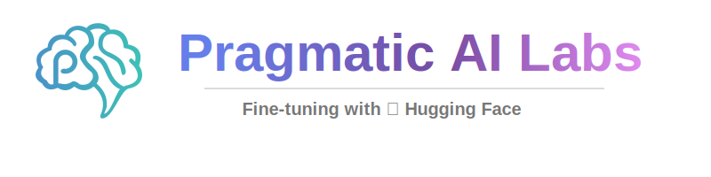
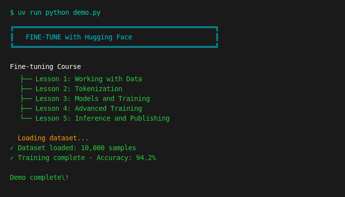

# Fine-tuning with Hugging Face

<p align="center">
  <a href="https://www.coursera.org/learn/fine-tuning-transformers-with-hugging-face?specialization=hugging-face-ai-development" title="Pragmatic AI Labs">
    
  </a>
</p>

[](https://www.python.org/downloads/)
[](LICENSE)
[](https://huggingface.co/docs/transformers)

<p align="center">
  <strong>Hands-on labs for fine-tuning transformer models with Hugging Face</strong><br>
  Datasets | Tokenizers | Trainer API | Model Publishing
</p>

---

## Table of Contents

- [Overview](#overview)
- [Quick Start](#quick-start)
- [Demo Preview](#demo-preview)
- [Installation](#installation)
- [Usage](#usage)
- [Capstone Project](#capstone-project)
- [Course Outline](#course-outline)
- [Project Structure](#project-structure)
- [Development](#development)
- [Resources](#resources)
- [Contributing](#contributing)
- [License](#license)

---

## Overview

Learn to fine-tune transformer models using the Hugging Face ecosystem. This course covers:

- **Dataset handling** — Load from CSV, JSON, Parquet, and Hugging Face Hub
- **Tokenization** — Padding, truncation, and special tokens
- **Training** — Trainer API with custom configurations
- **Advanced techniques** — Callbacks, early stopping, imbalanced data
- **Publishing** — Push models to Hugging Face Hub

---

## Quick Start

```bash
# Clone and install
git clone https://github.com/alfredodeza/hf-finetuning.git && cd hf-finetuning
uv sync --all-extras

# Run the interactive demo
uv run python demo.py

# Or run an example
uv run python examples/loading/load_csv.py
```

Or use **GitHub Codespaces** for zero-setup:

[](https://codespaces.new?hide_repo_select=true&ref=main)

---

## Demo Preview



Run `uv run python demo.py` to see the interactive demo.

---

## Installation

### Option 1: GitHub Codespaces (Recommended)

Click the badge above — Python and all dependencies are pre-configured.

### Option 2: Local Setup with uv

```bash
# Install uv (if needed)
curl -LsSf https://astral.sh/uv/install.sh | sh

# Clone and install
git clone https://github.com/alfredodeza/hf-finetuning.git
cd hf-finetuning
uv sync --all-extras
```

### Option 3: Traditional pip

```bash
git clone https://github.com/alfredodeza/hf-finetuning.git
cd hf-finetuning
python -m venv .venv
source .venv/bin/activate
pip install -r examples/requirements.txt
```

---

## Usage

### Run Examples

```bash
# Dataset loading
uv run python examples/loading/load_csv.py
uv run python examples/loading/load_hub.py

# Tokenization
uv run python examples/tokenize/padding.py

# Training
uv run python examples/training/train_classifier.py

# Inference
uv run python examples/inferencing/predict.py
```

### Complete the Labs

| Lab | Topic | Examples |
|-----|-------|----------|
| [Lab 1](./labs/lab-1.md) | Loading and Exploring Datasets | `loading/` |
| [Lab 2](./labs/lab-2.md) | Transformations and Tokenization | `transform/`, `tokenize/` |
| [Lab 3](./labs/lab-3.md) | Custom Datasets and Augmentation | `augment/`, `imbalance/` |
| [Lab 4](./labs/lab-4.md) | Training with Trainer API | `training/`, `models/` |
| [Lab 5](./labs/lab-5.md) | Advanced Training and Callbacks | `custom/`, `callback/` |
| [Lab 6](./labs/lab-6.md) | Publishing Models | `publishing/` |

### Capstone Project

After completing all labs, build a production-ready **Sentiment Analysis Pipeline** in the [Capstone Project](./docs/capstone-project.md). This project combines data loading, tokenization, training, callbacks, and Hub publishing into a complete fine-tuning workflow.

---

## Course Outline

### Lesson 1: Working with Data
- [Loading datasets from different formats](./examples/loading/)
- [Transforming datasets](./examples/transform/)
- [Handling imbalanced data](./examples/imbalance/)
- [Data augmentation techniques](./examples/augment/)

### Lesson 2: Tokenization
- [Tokenization with padding](./examples/tokenize/)
- [Tokenization with truncation](./examples/tokenize/)

### Lesson 3: Models and Training
- [Working with pre-trained models](./examples/models/)
- [Training a classifier](./examples/training/)
- [Custom training configurations](./examples/custom/)

### Lesson 4: Advanced Training
- [Training callbacks and logging](./examples/callback/)
- [Optimization techniques](./examples/custom/)

### Lesson 5: Inference and Publishing
- [Running inference](./examples/inferencing/)
- [Publishing models to Hugging Face Hub](./examples/publishing/)

---

## Project Structure

```
huggingface-fine-tuning/
├── examples/
│   ├── loading/      # Dataset loading (CSV, JSON, Hub)
│   ├── transform/    # Data transformations
│   ├── tokenize/     # Tokenization examples
│   ├── augment/      # Data augmentation
│   ├── imbalance/    # Handling imbalanced data
│   ├── models/       # Pre-trained models
│   ├── training/     # Trainer API usage
│   ├── custom/       # Custom configurations
│   ├── callback/     # Training callbacks
│   ├── inferencing/  # Running inference
│   └── publishing/   # Publishing to Hub
├── labs/             # Hands-on lab instructions
├── tests/            # Test suite
└── demo.py           # Interactive demo
```

---

## Development

```bash
# Install with dev dependencies
uv sync --all-extras

# Run tests
uv run pytest tests/ -v

# Lint code
uv run ruff check examples/

# Format code
uv run ruff format examples/
```

---

## Resources

- [Hugging Face Documentation](https://huggingface.co/docs)
- [Transformers Library](https://huggingface.co/docs/transformers)
- [Datasets Library](https://huggingface.co/docs/datasets)
- [Hugging Face Course](https://huggingface.co/course)

**Related Courses:**

- [MLOps Specialization](https://www.coursera.org/specializations/mlops-machine-learning-duke)
- [Python for MLOps](https://www.coursera.org/learn/python-essentials-mlops-duke)

---

## Contributing

See [CONTRIBUTING.md](CONTRIBUTING.md) for guidelines.

1. Fork the repository
2. Create a feature branch
3. Run tests: `uv run pytest tests/`
4. Submit a pull request

---

## License

Apache License 2.0 — see [LICENSE](LICENSE) for details.

---

<p align="center">
  Made with care by <a href="https://paiml.com">Pragmatic AI Labs</a>
</p>
